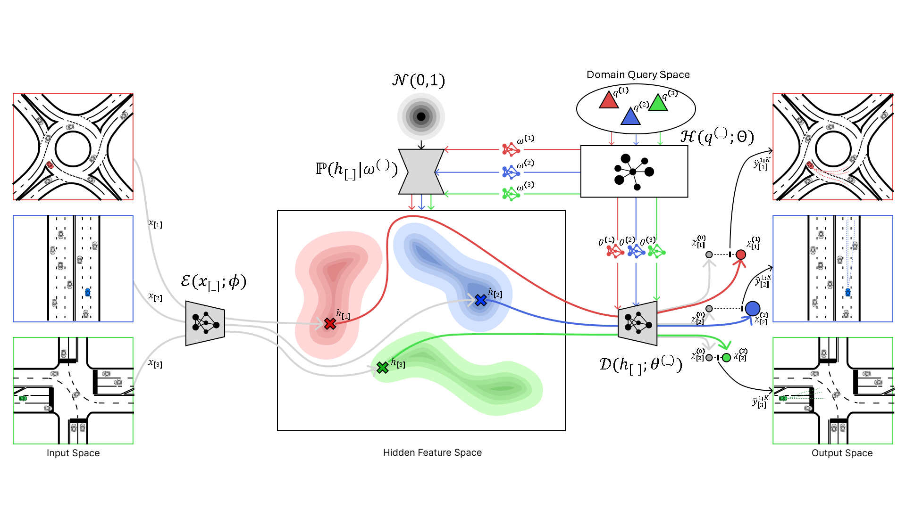
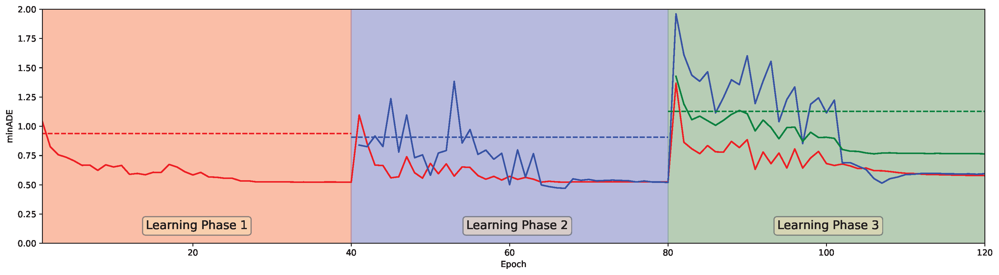

# DECODE: Domain-aware Continual Domain Expansion for Motion Prediction

## I. Introduction

### About

Welcome to the official GitHub repository for our paper on the DECODE framework, a novel continual learning framework for motion prediction. This repository contains all the necessary code and resources to replicate the results and experiments presented in our study. It is developed by the [Michigan Traffic Lab](https://traffic.engin.umich.edu/) at the University of Michigan.

### Features

The code in this repository provides the following features:
- Data processing for several motion datasets following ScenarioNet definition.
- Continual learning of a motion prediction model using the DECODE framework as shown below


### Code Structure

The structure of the code is as follows:

```
DECODE
├── configs # This folder contains all configuation files which are managed by Hydra
│   ├── config.yaml
│   ├── method
│   │   ├── DECODEMTR.yaml
│   │   ├── ...
│   │   └── preMTR.yaml
│   ├── method
│   │   ├── rounD.yaml
│   │   ├── highD.yaml
│   │   └── inD.yaml
├── domain_expansion # This folder contains main functions
│   ├── dataset # This folder contains data preprocessing functions
│   │   ├── converter.py
│   │   └── data_process.py
│   ├── continual # This folder contains continual learning models
│   │   ├── hyperMTR.py
│   │   ├── erMTR.py
│   │   └── ewcMTR.py
│   ├── detector # This folder contains domain awareness functions
│   │   ├── flow.py
│   │   └── lgmm.py
│   ├── model # This folder contains the specific motion prediction model
│   │   ├── mtr
│   ├── hypermodel # This folder contains hypernetwork-related functions
│   ├── natural # This folder contains deep Bayesian uncertainty estimation functions
│   └── utils
├── scripts # This folder contains executable scripts and main functions
│   ├── continual_train.py
│   ├── convert_data.py
├── data # [Optional] Store raw and processed data here 
│   ├── rounD
│   ├── highD
│   └── inD
└── results # [Optional] Store model checkpoints here
```

## II. Installation and Environment Configuration

### Pre-requirements 

0. We strongly suggest users to create a conda environment to install all dependencies.
```bash
conda create -n DECODE python=3.8
conda activate DECODE
```
1. Install ScenarioNet: https://scenarionet.readthedocs.io/en/latest/install.html
2. Install Unitraj: https://github.com/vita-epfl/UniTraj/tree/main?tab=readme-ov-file

### Installation and configuration

```bash
git clone https://github.com/michigan-traffic-lab/DECODE.git
cd DECODE
pip install -r requirements.txt
```

## III. Dataset

### Dataset download

Three datasets are used in this repo: RounD, HighD, and InD. They can be dowloaded from the following websites:

RounD: https://levelxdata.com/round-dataset

HighD: https://levelxdata.com/highd-dataset

InD: https://levelxdata.com/ind-dataset

The downloaded datasets should be placed in the data folder according their respective subfolder names. We used a commonroad lanelet format for map description. 
The trained models for evaluation should be placed in the results folder.
Both data and model related materials can be found using the following link: https://d1avza5eyi8p22.cloudfront.net/DECODE/assets.zip

### Data Preprocessing

Once the datasets are downloaded, use the scripts in the `/scripts/data` folder to preprocess the dataset, as in the following example:
```bash
python ./domain_expansion/convert_data.py \
  -n rounD \
  -d ./data/rounD/training_converted \
  --raw_data_path ./data/rounD/training \
  --num_workers 6 \
  --overwrite
```

## IV. Usage

### Continual Train MTR model with DECODE strategy:
#### Domain 1
```
python ./scripts/continual_train.py method=DECODEMTR domain=rounD
```
#### Domain 2
```
python ./scripts/continual_train.py method=DECODEMTR domain=highD
```
#### Domain 3
```
python ./scripts/continual_train.py method=DECODEMTR domain=inD
```

### Evaluate trained MTR model with DECODE strategy:
```
python ./scripts/model_evaluation.py method=DECODEMTR domain=rounD ckpt_path="./results/DECODEMTR/rounD_p1.ckpt"
```

## V. Main results


## VI. Contributing

Contributions are what make the open-source community such an amazing place to learn, inspire, and create. Any contributions you make are greatly appreciated.

## VII. License

This project is licensed under the GNU Affero General Public License v3.0. Please refer to LICENSE for more details.

## VIII. Third-Party Attribution

This project includes code and content adapted from the following sources:

1. **mammoth**  
   Adapted from (<https://github.com/aimagelab/mammoth/tree/master>).  
   Licensed under the MIT License.  

2. **natural-posterior-network**  
   Adapted from (<https://github.com/borchero/natural-posterior-network.git>).  
   Licensed under the MIT License. 

3. **UniTraj**  
   Adapted from (<https://github.com/vita-epfl/UniTraj.git>).  
   Licensed under the GNU Affero General Public License v3.0.

4. **MTR**  
   Adapted from (<https://github.com/sshaoshuai/MTR.git>).  
   Licensed under the Apache License v2.0.

See the `NOTICE` file for more details.


## IX. Developers

- Boqi Li (boqili@umich.edu)
- Rusheng Zhang (rushengz@umich.edu)

## X. Contact

- Henry Liu (henryliu@umich.edu)
